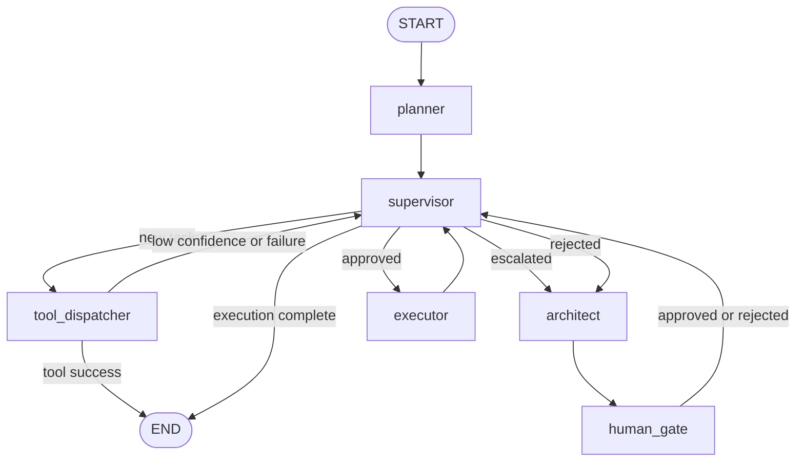

# Agent OS LangGraph

[](https://github.com/simon-aibc/agent-os-langgraph/actions/workflows/ci.yml)
[](LICENSE)


Production-style multi-agent orchestration built with LangGraph.
Deterministic tools handle known work; ambiguous work escalates through an architect, human plan gate, and sandboxed executor.
Typed state, durable SQLite checkpoints, MCP adapters, and an offline-tested streaming CLI demonstrate production engineering—not a tutorial chatbot.



## 30-second quickstart

```bash
python -m venv .venv
source .venv/bin/activate
python -m pip install -e ".[dev]"

# Deterministic Tier-1 path: no LLM or network required.
agent-os "read_file README.md" --thread-id quickstart --sandbox .
```

Expected structure:

```text
[THREAD] quickstart
[SUPERVISOR] → tool_dispatcher
[TOOL] read_file({"path": "README.md"})
[RESULT] # Agent OS LangGraph ...
```

For architect/executor workflows, copy [.env.example](.env.example) to `.env`,
configure `LLM_ROUTER`, `LLM_ARCHITECT`, and `LLM_EXECUTOR`, then run:

```bash
agent-os "refactor the target module and add regression tests" \
  --thread-id refactor-demo \
  --sandbox ./sandbox
```

At the plan gate the CLI pauses inline and accepts `approved`, `y`, or
`rejected: <reason>`. A stopped process resumes from SQLite without repeating
the original task:

```bash
agent-os --resume --thread-id refactor-demo --sandbox ./sandbox
# Equivalent entrypoint: python -m agent_os ...
```

## Architecture

- `SimonState` is a `TypedDict`; complex boundaries such as `ArchitectBrief`,
  `RouterDecision`, and `ExecutorReport` are Pydantic models.
- The supervisor uses explicit routing precedence. The dispatcher can terminate
  directly on tool success or return to the supervisor for agent escalation.
- The architect has read-only planning tools. Its brief reaches `human_gate`
  before the executor agent can edit files or run verification commands.
- LangGraph `interrupt()` plus a SQLite checkpointer preserves pending work by
  `thread_id`, including across process restarts.
- The CLI consumes `astream_events(version="v2")` and prints model tokens,
  node routes, tool calls, and results—never private chain-of-thought.

See [docs/architecture.md](docs/architecture.md) for routing precedence,
state rationale, trust boundaries, and the decision log. The approved product
requirements are in [docs/PRD.md](docs/PRD.md).

## What each milestone demonstrates

| Milestone | Implemented capability | Hiring signal |
|---|---|---|
| R1 | Typed state and compiled graph skeleton | Understands LangGraph state and graph construction |
| R2 | Conditional supervisor routing and bounded recursion | Designs deterministic control flow instead of prompt-only routing |
| R3 | Read-only architect subgraph with structured brief | Separates planning from execution and tests agents offline |
| R4 | Executor subgraph with path checks, `shell=False`, and timeouts | Treats tool execution as a security boundary |
| R5 | Interrupt-driven human plan gate | Adds approval before agent-planned side effects |
| R6 | SQLite checkpoints and restart/resume tests | Builds workflows that survive process failure |
| R7 | Three-tier router, pluggable registry, and MCP adapters | Balances deterministic speed, model judgment, and extensibility |
| R8 | Rich streaming CLI with durable resume | Delivers an operator-facing interface with explicit failure semantics |

## Extending Agent OS

### Register a native tool

`RegisteredSkill` accepts LangChain `BaseTool` objects or plain callables. A
custom skill becomes available to the structured router without changing the
dispatcher:

```python
from langchain_core.tools import tool

from agent_os.default_registry import build_default_registry
from agent_os.graph import build_graph
from agent_os.nodes.tool_dispatcher import build_tool_dispatcher_node
from agent_os.skills import RegisteredSkill


@tool
def summarize(text: str) -> str:
    """Return a compact summary."""
    return text[:200]


registry = build_default_registry()
registry.register(RegisteredSkill("summarize", (), summarize))
dispatcher = build_tool_dispatcher_node(registry=registry)
custom_graph = build_graph(tool_dispatcher_node_impl=dispatcher)
```

### Load MCP tools

```python
from agent_os.default_registry import build_default_registry_with_mcp
from agent_os.graph import build_graph
from agent_os.nodes.tool_dispatcher import build_tool_dispatcher_node


async def build_mcp_graph():
    registry = await build_default_registry_with_mcp()
    dispatcher = build_tool_dispatcher_node(registry=registry)
    return build_graph(tool_dispatcher_node_impl=dispatcher)
```

Enable servers with `MCP_FILESYSTEM_ENABLED`, `MCP_CODEGRAPH_ENABLED`, and
`MCP_GBRAIN_URL`. `MCP_CODEGRAPH_COMMAND` overrides the CodeGraph executable.

> `from agent_os.graph import graph` intentionally uses native tools only.
> Environment flags do not auto-load MCP tools into that default graph; use the
> asynchronous registry construction and dispatcher injection shown above.

### Swap LLMs

Model roles use provider/model strings from `.env`. Tests or applications may
also inject any compatible `BaseChatModel` into `build_architect_agent()`,
`build_executor_agent()`, or `build_tool_dispatcher_node()`.

## Security and trust boundaries

- The HITL gate protects **agent-planned executor work**. Explicit Tier-1
  commands such as `write_file ...` or `bash ...` are treated as direct user
  instructions and execute without an additional approval prompt.
- Native writes and subprocesses use `AGENT_OS_SANDBOX` (default `./sandbox`).
  CLI `--sandbox` also constrains reads for that invocation. These are path/cwd
  controls, not OS or container isolation.
- Subprocesses use argument arrays, `shell=False`, captured output, and a
  timeout. Untrusted models or commands still require a container.
- The filesystem MCP server additionally requires its resolved root to be
  strictly below the user home. Every enabled MCP server extends the trust
  boundary and must be trusted.
- SQLite checkpoints may contain tasks, messages, plans, tool results, and
  file content. They are gitignored and should be protected as sensitive data.
- Checkpoint deserialization allowlists application Pydantic types. CLI tool
  arguments redact common credential fields before display.
- CLI startup uses LiteLLM's local model-cost map, avoiding an incidental
  metadata request before the workflow begins.
- Bash and dispatcher output size caps remain deferred to R11.

## CLI exit codes

| Code | Meaning |
|---:|---|
| `0` | Workflow completed successfully |
| `1` | Workflow or graph execution failed |
| `2` | Invalid CLI/configuration/resume request |
| `130` | Interrupted with Ctrl+C; checkpoint preserved when available |

## Development and testing

```bash
python -m ruff check .
python -m pytest -W error
```

The default suite is offline and deselects real MCP integration tests. Run an
enabled integration explicitly, for example:

```bash
MCP_FILESYSTEM_ENABLED=true \
AGENT_OS_SANDBOX="$HOME/agent-os-sandbox" \
python -m pytest -m integration tests/test_mcp_integration.py
```

CI runs Ruff and the offline test suite on Python 3.11 and 3.12.

## Roadmap / v2 backlog

- R10: record and embed an end-to-end demo.
- R11: cap subprocess/dispatcher output, add budget hooks, trim messages, and
  document token-economy measurements.
- Run untrusted execution in a disposable container or microVM.
- Add an optional web interface only after the CLI workflow is validated.

Licensed under the [MIT License](LICENSE).
