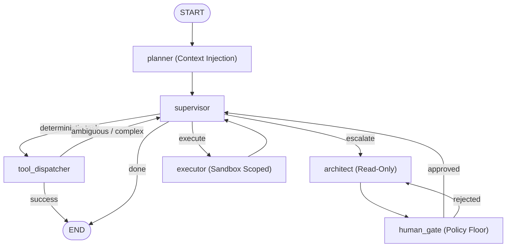

# Agent OS LangGraph

[](https://github.com/simon-aibc/agent-os-langgraph/actions/workflows/ci.yml)
[](LICENSE)

[](https://github.com/simon-aibc/agent-os-langgraph/releases/tag/v2.4.0)


> **Agent OS LangGraph: Everything is a Plugin.**<br>
> An open-source, local-first backbone for building durable, controllable multi-agent systems with LangGraph.

Agent OS LangGraph provides an auditable, self-hosted reference harness featuring deterministic tool dispatch, read-only architect planning, human approval gates, sandbox-scoped execution, SQLite checkpoints, durable run ledgers, anti-SSRF webhook egress, and a stable extension plugin system.

**Current release:** [v2.4.0](https://github.com/simon-aibc/agent-os-langgraph/releases/tag/v2.4.0) |
[Changelog](CHANGELOG.md) |
[Architecture](docs/architecture.md) |
[Extending Agent OS](docs/EXTENDING.md) |
[Self-Hosting](docs/self-hosting.md) |
[Product Spec](docs/PRD.md) |
[Roadmap](docs/roadmap.md)

---

## Table of Contents

1. [Architecture](#architecture)
2. [Everything is a Plugin](#everything-is-a-plugin)
3. [Quickstart](#quickstart)
4. [Usage Guide](#usage-guide)
5. [Self-Hosting & Docker](#self-hosting--docker)
6. [Testing & Conformance Kit](#testing--conformance-kit)
7. [Security & Trust Boundaries](#security--trust-boundaries)
8. [Contributing & Development](#contributing--development)
9. [License](#license)

---

## Architecture

Agent OS separates agent reasoning into bounded, observable stages:

- **Deterministic Fast-Path**: Exact low-risk tool invocations execute immediately without invoking an LLM.
- **Architect Planning**: Complex or ambiguous goals escalate to a read-only architect that produces structured execution proposals.
- **Human Gate & Policy Floor**: Side-effect proposals require approval; non-bypassable policy floors enforce hard safety denials.
- **Sandboxed Execution**: Side effects execute only within configured workspace sandboxes.
- **Durable Checkpoints & Audit**: Graph execution states, run ledgers, permission rules, and observation evidence persist across restarts in WAL-mode SQLite databases.



---

## Everything is a Plugin

Agent OS exposes a frozen, stable public facade under `agent_os.api` with 7 standard plugin entry-point groups:

| Plugin Group | Protocol / Base | Description |
|---|---|---|
| `agent_os.connectors` | `Connector` | Custom action tools and external API adapters |
| `agent_os.memory_connectors` | `MemoryConnector`, `WritableMemory`, `IndexableMemory` | Long-term memory vaults (Markdown, G-Brain, SQLite, vector) |
| `agent_os.backends` | `BackendAdapter` | Model execution backends (Claude Code, Codex CLI, LiteLLM, Ollama) |
| `agent_os.policies` | `PolicyEngine` | Custom policy evaluators and organizational approval rules |
| `agent_os.skill_packages` | `SkillPackageLoader` | Reusable skill bundles and prompt workflows |
| `agent_os.context_providers` | `ContextProvider` | Pre-planner retrieval and dynamic context injection hooks |
| `agent_os.event_sinks` | `EventSink` | Lifecycle run event egress and signed webhook delivery |

### Stable Public API

All third-party extensions build directly against `agent_os.api`:

```python
from agent_os.api import (
    Connector,
    ContextProvider,
    ContextBlock,
    EventSink,
    IndexableMemory,
    MemoryConnector,
    PluginRegistry,
    Principal,
)
```

---

## Quickstart

### Prerequisites

- Python 3.11 or 3.12
- Git
- Docker with Compose v2 (optional, for local self-hosted stack)

### 1. Installation

```bash
git clone https://github.com/simon-aibc/agent-os-langgraph.git
cd agent-os-langgraph

python -m venv .venv
source .venv/bin/activate
pip install -e ".[dev,serve]"
```

### 2. Zero-LLM Deterministic Fast-Path

Run exact tool commands with zero model dependencies:

```bash
agent-os "read_file README.md" --thread-id quickstart --sandbox .
```

Output:
```text
[THREAD] quickstart
[SUPERVISOR] -> tool_dispatcher
[TOOL] read_file({"path": "README.md"})
[RESULT] # Agent OS LangGraph ...
```

### 3. Configure LLM Model Roles

Copy the environment template and set your model backends:

```bash
cp .env.example .env
```

Agent OS reads 3 decoupled roles:

```bash
LLM_ROUTER="ollama/qwen2.5:14b"
LLM_ARCHITECT="anthropic/claude-opus-4-8"
LLM_EXECUTOR="openai/gpt-5.5"
```

You can also use authenticated subscription CLIs:

```bash
LLM_ARCHITECT=cli/claude-code
LLM_EXECUTOR=cli/codex
```

---

## Usage Guide

### Architect + Human Approval Gate

When a goal requires complex changes, the system creates a proposal and pauses for interactive or API review:

```bash
agent-os "add docstrings to math_util.py and verify syntax" \
  --thread-id docstring-task \
  --sandbox ./sandbox
```

At the approval prompt, choose `approved`, `session`, `always_approve`, or `rejected: <reason>`.

Interrupted runs resume seamlessly from SQLite checkpoints:

```bash
agent-os --resume --thread-id docstring-task --sandbox ./sandbox
```

### Multi-Turn Chat, Sessions & Schedules

```bash
# Interactive multi-turn conversation
agent-os chat --thread-id daily-session

# Session inspection
agent-os sessions list
agent-os sessions inspect daily-session

# Local cron/interval schedules
agent-os schedule list
```

### Self-Update & Migrations

```bash
# Check for latest updates against GitHub releases (cached)
agent-os update --check

# Execute upgrade with pre-migration database backup
agent-os update --yes --reload
```

---

## Self-Hosting & Docker

### Run with Docker Compose

Start the Agent OS backend runtime and web console with a single command:

```bash
docker compose up -d
```

- **Runtime API**: `http://127.0.0.1:4680`
- **Operator Console**: `http://127.0.0.1:3000`
- **API Health**: `http://127.0.0.1:4680/api/health`

### Run Runtime Server Locally

```bash
agent-os serve --host 127.0.0.1 --port 4680
```

Key endpoints:
- `GET /api/health` — Runtime health and update cache status
- `POST /api/runs` — Trigger non-blocking asynchronous agent runs
- `GET /api/runs/events` — Server-Sent Events (SSE) stream for live run output
- `POST /api/runs/{run_id}/approve` — Submit approval or rejection for gated steps

---

## Testing & Conformance Kit

Agent OS includes a dependency-light conformance testing kit under `agent_os.testing.conformance` for verifying custom plugins:

```python
from agent_os.testing.conformance import (
    check_connector,
    check_memory_connector,
    check_context_provider,
    check_event_sink,
)

def test_my_custom_plugin():
    my_sink = MyCustomEventSink()
    check_event_sink(my_sink)
```

Run the complete test suite:

```bash
pytest -q
```

---

## Security & Trust Boundaries

- **Immutable Policy Floor**: Hard safety constraints (such as `payment` and `privileged` actions) cannot be bypassed or overridden by plugins, even in permissive policy modes.
- **DNS-Rebinding Safe Webhooks**: Webhook delivery validates IP addresses against loopback/private ranges and pins sockets with TLS SNI validation.
- **Server-Trusted Actor Identity**: `Principal` provenance is resolved securely server-side to prevent HTTP header spoofing.
- **Workspace Isolation**: Database files, permission rules, and observations are isolated per workspace.

---

## Contributing & Development

We welcome contributions! Please review:
- [CONTRIBUTING.md](CONTRIBUTING.md) — Guidelines for code style, tests, and PR process.
- [docs/EXTENDING.md](docs/EXTENDING.md) — Guide to authoring plugins, connectors, and policies.
- [docs/architecture.md](docs/architecture.md) — Complete system architecture.

---

## License

[MIT](LICENSE) © Simon Tran
