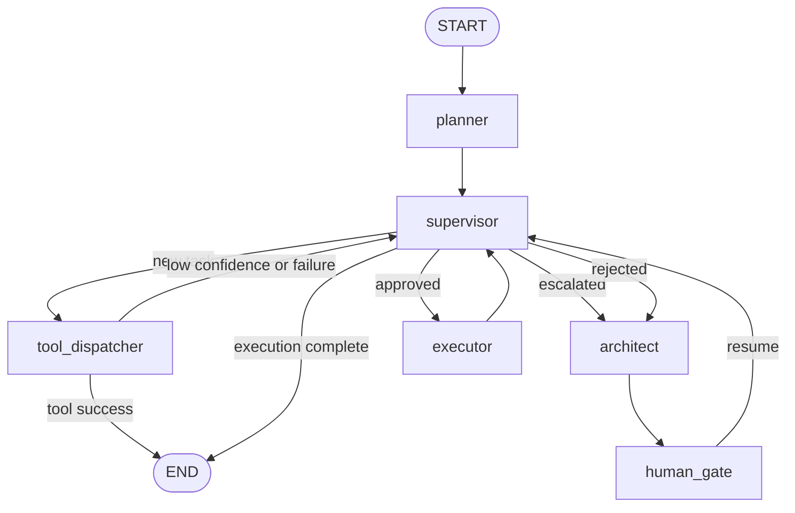

# Agent OS architecture

This document describes the graph implemented in the repository today. Product
intent and future requirements live in the [approved PRD](PRD.md).

## System overview

Agent OS separates orchestration into a deterministic graph and bounded agent
roles:

- `planner` preserves a structured brief or initializes the plan from the task.
- `supervisor` converts state into an explicit graph destination.
- `tool_dispatcher` handles known tools or escalates ambiguous work.
- `architect` creates a structured plan using read-only tools.
- `human_gate` pauses that plan for approval or rejection.
- `executor` edits and verifies within the configured native sandbox.

The graph is assembled in [`agent_os/graph.py`](../agent_os/graph.py).

The dispatcher returns `Command(goto=END)` on success, so that path does not
pass through the supervisor again. Architect, gate, and executor edges are
explicit; supervisor destinations are conditional.

## State and boundary models

[`SimonState`](../agent_os/state.py) is a `TypedDict`, which lets LangGraph own
state-channel behavior without wrapping the entire graph state in a runtime
model. `messages` uses LangGraph's `add_messages` reducer. Complex values cross
node boundaries as Pydantic models from
[`agent_os/schemas.py`](../agent_os/schemas.py).

| Field | Type | Purpose |
|---|---|---|
| `messages` | `list[AnyMessage]` with reducer | Conversation and model messages |
| `task` | `str` | Original user instruction |
| `plan` | `str \| ArchitectBrief \| None` | Initial plan text or architect contract |
| `executor_output` | `str \| ExecutorReport \| None` | Legacy text or structured execution report |
| `human_feedback` | `str \| None` | `approved` or `rejected: <reason>` |
| `hot_context` | `str \| None` | Static session-start context (hot.md, AI/Memory, spine files), distinct from conversation_summary |
| `tool_result` | optional `ToolExecutionResult \| None` | Serialized dispatcher result |
| `router_escalated` | optional `bool` | Dispatcher-to-supervisor escalation signal |

This hybrid keeps state updates lightweight while validating plans, router
decisions, tool results, and executor reports at their boundaries. The removed
boolean `approval` field is intentionally not migrated; new checkpoints use
the richer `human_feedback` contract.

## Routing precedence

[`route_from_state()`](../agent_os/routing.py) evaluates conditions in this
exact order:

| Priority | Condition | Route | Reason |
|---:|---|---|---|
| 1 | Successful `ExecutorReport` | `end` | Execution completed |
| 2 | `human_feedback == "approved"` | `executor` | Run the reviewed plan |
| 3 | Feedback begins with `rejected:` | `architect` | Revise using the reason |
| 4 | `executor_output` is a legacy string | `end` | Preserve the remaining text-output contract |
| 5 | `plan` is an `ArchitectBrief` with no feedback | `end` | Do not execute an undecided plan |
| 6 | `router_escalated is True` | `architect` | Tool routing could not safely resolve the task |
| 7 | Otherwise | `tool` | Give the lowest-cost dispatcher the first attempt |

The function does not inspect `ToolMessage`, `AIMessage.tool_calls`, or model
prose. [`supervisor_node`](../agent_os/nodes/supervisor.py) maps the logical
route to a concrete node and returns a LangGraph `Command`.

An approved workflow with a failed executor report retries the executor. The
default runtime recursion limit of seven graph steps bounds this retry shape
and other accidental loops.

## Three-tier dispatcher

[`agent_os/nodes/tool_dispatcher.py`](../agent_os/nodes/tool_dispatcher.py)
implements three progressively more expensive paths:

1. **Deterministic:** an exact canonical name or alias in the first task token
   is parsed for the native `read_file`, `write_file`, and `bash` contracts.
2. **Structured model:** unresolved text is classified into a
   `RouterDecision` against the injected registry catalog.
3. **Escalation:** confidence below `0.80`, an unknown tool, parser failure, or
   tool exception returns to the supervisor with `router_escalated=True`.

A successful tool invocation stores `ToolExecutionResult` and goes directly to
`END`. The default registry is native-only. MCP tools are loaded asynchronously
and require an injected registry/dispatcher; environment flags alone do not
modify the module-level default graph.

## Human gate and durable resume

The architect's only outgoing edge is `human_gate`. The node calls LangGraph
`interrupt()` with the serialized `ArchitectBrief`. At that point:

1. the checkpointer persists state under `configurable.thread_id`;
2. the CLI reads the pending interrupt from the state snapshot;
3. invalid input is rejected locally without advancing the graph;
4. `Command(resume="approved")` continues to the supervisor and executor;
5. `Command(resume="rejected: ...")` returns through the architect and pauses
   on a revised brief.

The default graph uses synchronous `SqliteSaver`. The streaming CLI builds the
same graph with `AsyncSqliteSaver`, consumes `astream_events(version="v2")`,
and proves resume with a fresh graph/checkpointer context. The checkpoint
serializer allowlists application Pydantic types instead of permitting
arbitrary msgpack reconstruction. See
[`agent_os/checkpoints.py`](../agent_os/checkpoints.py) and
[`agent_os/cli/app.py`](../agent_os/cli/app.py).

## Sandbox and trust boundaries

The repository uses multiple related controls rather than claiming a complete
OS sandbox:

- Native writes, bash commands, and tests operate under `AGENT_OS_SANDBOX`,
  defaulting to `./sandbox`. Bash receives an argument list, uses
  `shell=False`, captures output, and has a timeout.
- CLI `--sandbox` also makes read/grep roots resolve from that directory for
  the duration of the invocation. Without an explicit sandbox, read-only
  architect tools retain their project-cwd behavior.
- The filesystem MCP integration is stricter: its resolved root must be below,
  but not equal to, the current user home. Root, system directories, and
  symlink escapes are rejected.
- Other stdio and HTTP MCP servers are trusted external processes/services.
  Per-server connection failures are isolated, but enabling a server expands
  the trust boundary.

These controls do not isolate executables, networks, CPU, memory, or child
processes. Untrusted workloads require a container or microVM. Explicit Tier-1
write/bash commands are direct user instructions and do not pass through the
architect/HITL plan loop.

## Token economy

Agent OS treats each model invocation as a cost boundary:

1. **Structured outputs** (`agent_os/schemas.py`) bound response shapes with
   Pydantic contracts.
2. **Cascading routing** (`agent_os/nodes/tool_dispatcher.py`) tries the
   deterministic path before structured-model routing and agent escalation.
3. **HITL gating** (`agent_os/nodes/human_gate.py`) prevents unapproved plans
   from entering the Executor phase.
4. **Anthropic prompt caching** (`agent_os/llm.py`) adds an ephemeral
   `cache_control` content block to Architect and Executor system messages.
   Keeping this provider-specific representation at the LLM boundary prevents
   it from leaking into graph routing.
5. **8K message trimming** (`agent_os/messages.py`) bounds context at the
   Architect and Executor invocation boundaries without mutating persistent
   `SimonState`. Full history remains available for HITL review and replay.
6. **Output caps** (`agent_os/output_limits.py`) bound retained UTF-8 data to
   100KB per Bash stream and 50KB per dispatcher result before checkpointing.
   `subprocess.run(capture_output=True)` still buffers before this cap applies.
7. **Offline startup** (`agent_os/cli/app.py`) selects LiteLLM's local cost map
   before imports that could otherwise make an incidental metadata request.

## Connector framework & Memory write-path

Agent OS v1.5 introduces a robust connector framework:
- **ConnectorRegistry** maps standardized interfaces (`MemoryConnector`, `FilesystemConnector`) to portable implementations.
- **Write-path:** `WritableMemory` supports gated writes (`evaluate_write_policy`), ensuring agent-planned context writes require human approval (or fall under auto-approve policies like `AI/Logs/`).
Gated writes now flow through a shared `PolicyEngine` (`LocalPolicy`, 7-level side-effect taxonomy `none`/`read`/`write`/`network`/`communication`/`payment`/`privileged` -> `allow`/`deny`/`require_approval`); a memory write is one kind of action evaluated by that policy.

## Chat and Sessions
The CLI provides a `chat` loop for multi-turn conversations, preserving state across invocations. Sessions are indexed locally via SQLite, allowing users to list, inspect, and delete historical runs. A summarization engine condenses old messages into a rolling `conversation_summary`, injecting bounded context alongside `hot_context`.

## Runtime API
`agent-os serve` runs a localhost-first FastAPI interface from the `[serve]` extra, exposing sessions, a chat WebSocket, brief, and health endpoints for external UIs. It is the seam between the runtime and any interface.

## Extension points

- Register `RegisteredSkill` instances in an injected `SkillRegistry`.
- Supply `MCPServerConfigs` or an `MCPClientFactory`, then inject the resulting
  dispatcher into `build_graph()`.
- Inject compatible chat models into architect, executor, or smart-router
  factories.
- Replace architect, executor, dispatcher, or checkpointer implementations in
  `build_graph()` for deterministic tests or deployment-specific behavior.
- Use `InMemorySaver` for isolated tests and SQLite for durable workflows.

### CLI delegator backends

Agent OS supports `claude` (Claude Code) and `codex` (Codex CLI) as
subscription-backed Architect and Executor implementations. These CLIs are
agents with their own reasoning loops and native tools, not raw chat models.
Wrapping one in `BaseChatModel` would create an agent-inside-agent boundary and
would not produce the tool-call protocol expected by LangChain agents. Agent OS
therefore invokes each CLI as a delegator subprocess.

The delegator flow is:

1. The graph node passes a bounded state view to the CLI delegator.
2. The delegator starts the process in `AGENT_OS_SANDBOX` with fixed permission
   arguments.
3. Claude emits stream JSON; Codex writes its last structured message to a
   temporary file.
4. The delegator parses the payload and validates it as `ArchitectBrief` or
   `ExecutorReport`.

Codex uses OpenAI strict structured outputs. Before writing a Codex schema,
`strict_json_schema()` recursively marks every object with
`additionalProperties: false` and includes every property in `required`,
including object definitions under `$defs`. Claude receives the original
Pydantic schema because its CLI contract does not require this transformation.

The Architect uses Claude `plan` or Codex `read-only` mode, so transient
failures can be retried without replaying writes. The Executor uses Claude
`acceptEdits` or Codex `workspace-write`. It is never auto-retried: a provider
failure can occur after edits but before the final report, so the node warns
that partial sandbox changes may exist.

Before starting a child process, the shared runner removes credential-like
environment variables. Error excerpts redact known secret values and common
credential patterns. The runner fixes `cwd` and rejects known expansion or
bypass arguments such as `--add-dir`, `--cd`, and `--dangerously-*`.

Child stdin is connected to `DEVNULL`, so a workflow cannot perform an
interactive OAuth login. Known authentication failures are classified with
backend-specific guidance; users authenticate with `claude auth login` or
`codex login` before starting or resuming the graph.

These controls reduce accidental exposure and trivial configuration escapes;
they are not an OS sandbox or container boundary. Untrusted workloads still
require external isolation.

## Decision log

| Decision | Rationale | Trade-off |
|---|---|---|
| TypedDict state plus Pydantic artifacts | Fits LangGraph channels while validating complex boundaries | Full state validation is not automatic on every update |
| Conditional supervisor plus `Command` destinations | Makes routing observable and independently testable | Precedence must remain documented and covered by tests |
| Human plan gate before executor | Prevents autonomous agent-planned writes before review | Explicit deterministic write/bash commands remain direct operations |
| SQLite checkpointer | Local, portable, and sufficient for cross-process resume | Not a multi-host production database |
| Native-only default registry | Import and sync graph construction stay predictable | MCP users must build and inject an async-loaded registry |
| Per-server MCP loading | One unavailable server does not remove healthy tools | Startup may contain a partial tool catalog |
| Remove boolean `approval` | Rejection reasons belong in one normalized feedback field | Old checkpoints containing only `approval` are not migrated |
| Async CLI over the same graph | Enables event streaming without duplicating orchestration | Requires an async SQLite saver in the CLI boundary |
| No chain-of-thought display | Streams observable outputs without presenting hidden reasoning | Operators see contracts and events, not private model deliberation |
| Delegate to subscription CLIs instead of wrapping them as chat models | Preserves each CLI's native agent loop and structured-output contract | Adds process startup latency and no visibility into the CLI's internal reasoning stream |
| Transform schemas only at the Codex boundary | Satisfies OpenAI strict output requirements without changing Claude payload semantics | Provider-specific schema behavior needs dedicated contract tests |
